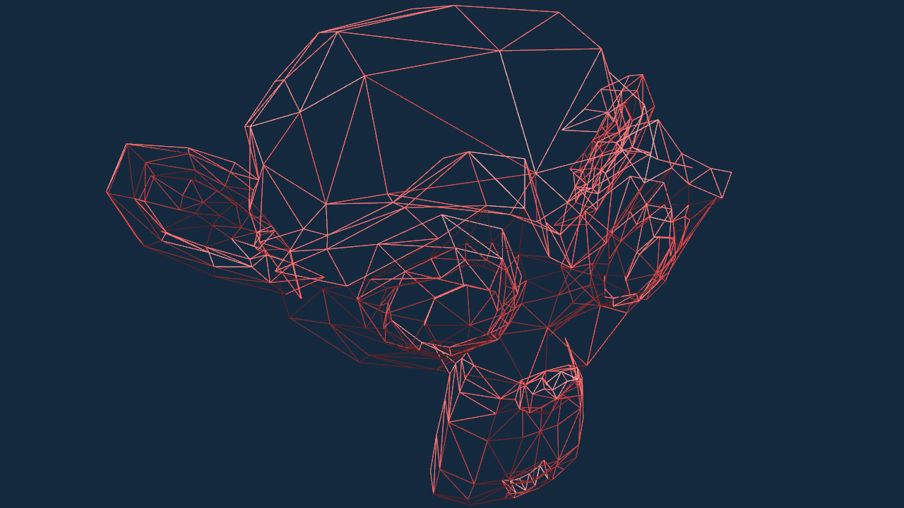
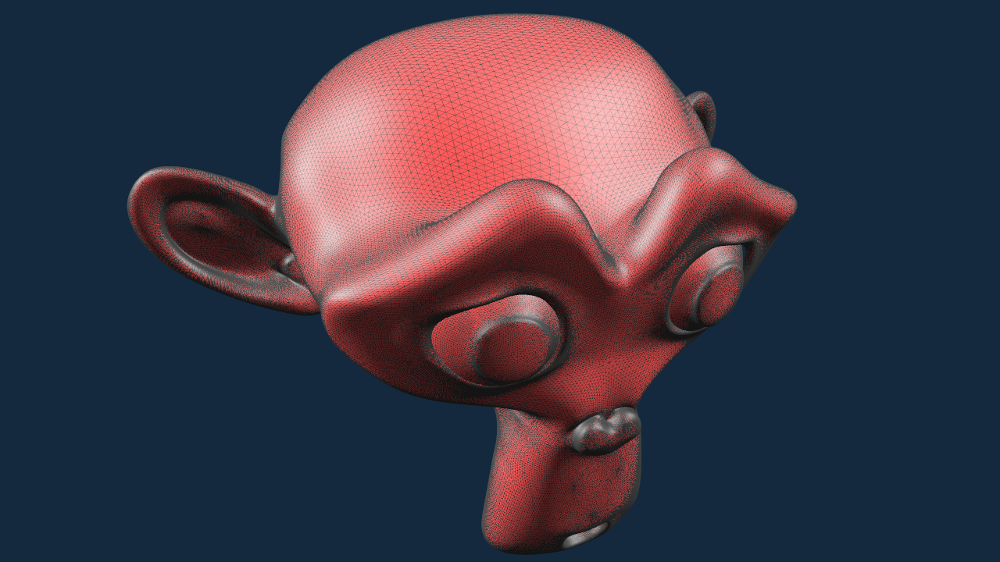

# subface

A collection of triangle subdivision/tessellation/decimation implementations.

# Compiling

```
git clone https://github.com/chaosink/subface.git --recursive
cd subface
mkdir build
cd build
cmake ..
cmake --build . --config Debug # Or Release
```

# Usage

* command line

```
Usage: subface [-h] [--cmd] [--export_obj] [--save_png] [--smooth] [--fix_camera] [--cull] [--transparent] [--render VAR] [--method VAR] [--level VAR] OBJ_file_path

Process geometries with one of the following methods:
    1.LoopSubdivideSmooth
    2.LoopSubdivideSmoothNoLimit
    3.LoopSubdivideFlat
    4.Tessellate4
    5.Tessellate4_1
    6.Tessellate3
    7.MeshoptDecimate
    8.MeshoptDecimateSloppy
    9.Decimate_ShortestEdge_V0
    10.Decimate_ShortestEdge_Midpoint


Positional arguments:
  OBJ_file_path         OBJ file path

Optional arguments:
  -h, --help            shows help message and exits
  -v, --version         prints version information and exits
  -c, --cmd             run in command line mode
  -e, --export_obj      export OBJ in command line mode
  -s, --save_png        save PNG in command line mode
  -n, --smooth          use smooth normal
  -f, --fix_camera      fix camera
  -u, --cull            enable face culling
  -t, --transparent     enable transparent window
  -r, --render          render mode ID [default: 0]
  -m, --method          processing method ID [default: 1]
  -l, --level           processing level [default: 0]
```

* rendering

key | function
-|-
`Tab` | switch rendering mode: FacesWireframe (default), FacesOnly, WireframeOnly
`N` | enable / disable (default) smooth rendering
`C` | enable / disable (default) face culling
`T` | enable / disable (default) transparent window
`F` | use camera's fixed parameters
`R` | refresh camera's fixed parameters
`P` | print camera's current parameters
`F2` | save the screenshot as a PNG file
`ESC` | exit

* camera controlling

key | function
-|-
(`Shift` +) `W`/`S`/`A`/`D`/`Q`/`E` | (slowly) move forward / backward / left / right / down / up
(`Shift` +) `J`/`L`/`I`/`K` | (slowly) turn left / right / up / down
`-`/`=` | slow down / speed up movement
`[`/`]` | slow down / speed up turning
`Space` | reset camera and model
`mouse left button` | rotate model
`mouse right button` | change camera direction
`mouse scroll wheel` | adjust field of view

* processing

key | function
-|-
`Ctrl` + `1`,`2`,...,`9`,`0` | choose processing methods, `0` for 10, default: `1`
`0`-`9` | processing level, `0` for the original mesh (default)
`,`/`.` | decimate one less/more triangle for the decimation methods
`O` | export the processed mesh as an OBJ file

# Results

* rendering modes

<table>
	<!-- FacesWireframe, FacesOnly -->
	<tr align="center">
		<th>
			FacesWireframe
		</th>
		<th>
			FacesOnly
		</th>
	</tr>
	<tr align="center">
		<td>
			</img>
		</td>
		<td>
			</img>
		</td>
	</tr>
	<!-- WireframeOnly with face culling, WireframeOnly without face culling -->
	<tr align="center">
		<th>
			WireframeOnly without face culling
		</th>
		<th>
			WireframeOnly with face culling
		</th>
	</tr>
	<tr align="center">
		<td>
			</img>
		</td>
		<td>
			</img>
		</td>
	</tr>
</table>

* 1.LoopSubdivideSmooth, flat vs smooth

<table>
	<!-- original mesh -->
	<tr align="center">
		<th>
			original mesh, flat
		</th>
		<th>
			original mesh, smooth
		</th>
	</tr>
	<tr align="center">
		<td>
			</img>
		</td>
		<td>
			</img>
		</td>
	</tr>
	<!-- level 1 -->
	<tr align="center">
		<th>
			level 1, flat
		</th>
		<th>
			level 1, smooth
		</th>
	</tr>
	<tr align="center">
		<td>
			</img>
		</td>
		<td>
			</img>
		</td>
	</tr>
	<!-- level 2 -->
	<tr align="center">
		<th>
			level 2, flat
		</th>
		<th>
			level 2, smooth
		</th>
	</tr>
	<tr align="center">
		<td>
			</img>
		</td>
		<td>
			</img>
		</td>
	</tr>
	<!-- level 3 -->
	<tr align="center">
		<th>
			level 3, flat
		</th>
		<th>
			level 3, smooth
		</th>
	</tr>
	<tr align="center">
		<td>
			</img>
		</td>
		<td>
			</img>
		</td>
	</tr>
	<!-- level 4 -->
	<tr align="center">
		<th>
			level 4, flat
		</th>
		<th>
			level 4, smooth
		</th>
	</tr>
	<tr align="center">
		<td>
			</img>
		</td>
		<td>
			</img>
		</td>
	</tr>
</table>
