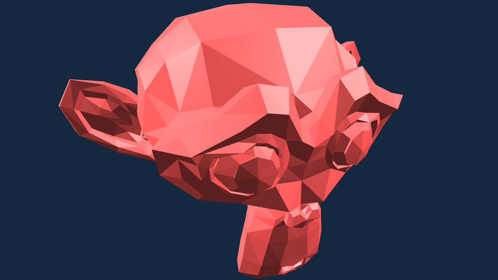
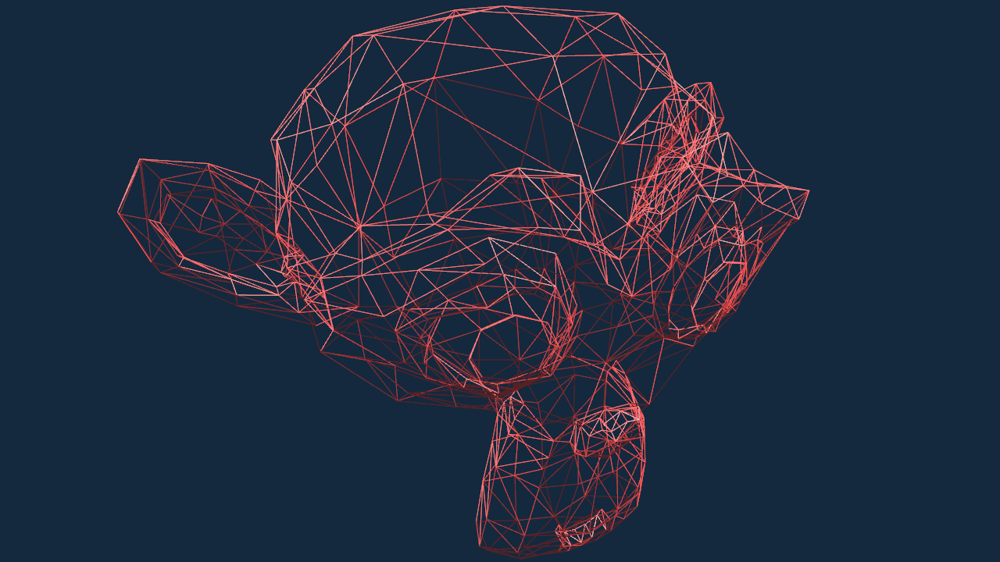
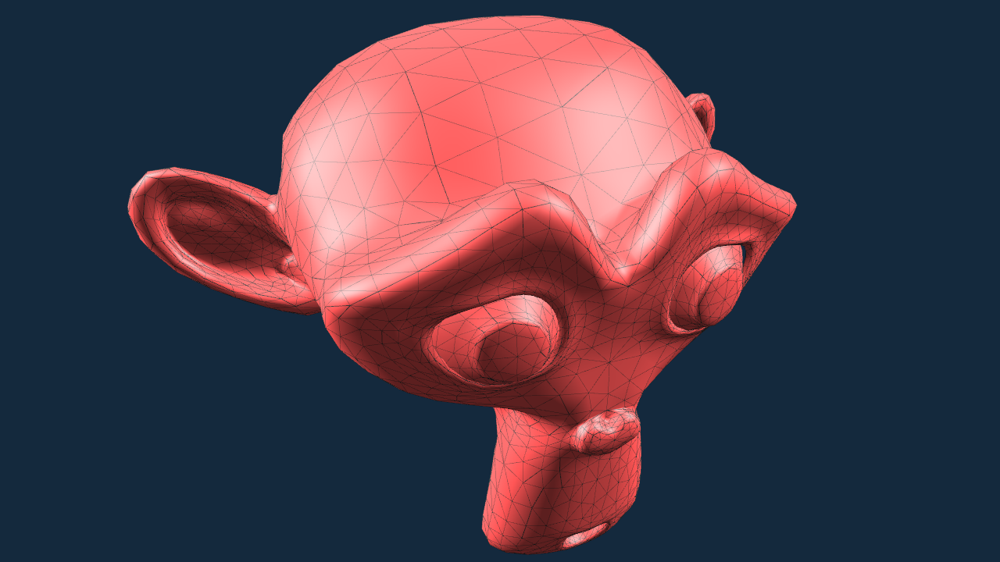
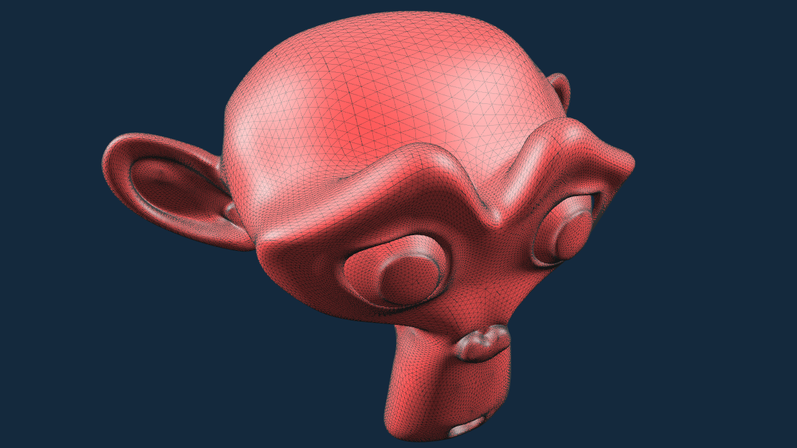
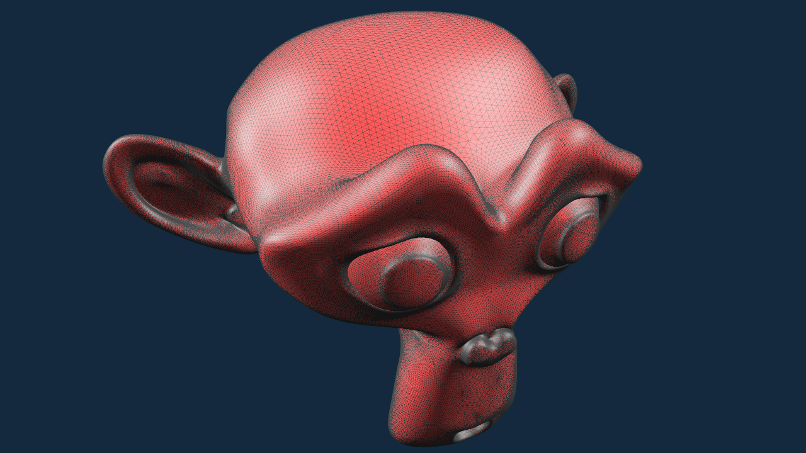

# subface

An implementation of Loop subdivision surfaces.

# Compiling

```
git clone https://github.com/chaosink/subface.git
cd subface
mkdir build
cd build
cmake ..
make
```

# Usage

```
./subface model_file.obj
```

* camera controlling

key | function
-|-
(`Shift` +) `W`/`S`/`A`/`D`/`Q`/`E` | (slowly) move forward / backward / left / right / down / up
(`Shift` +) `J`/`L`/`I`/`K` | (slowly) turn left / right / up / down
`-`/`=` | slow down / speed up movement
`[`/`]` | slow down / speed up turning
`Space` | reset camera
`mouse scroll wheel` | adjust field of view

* rendering

key | function
-|-
`0` - `9` | subdivision level, `0` for the original mesh(default)
`Tab` | switch rendering mode: face, wireframe, face + wireframe(default)
`N` | enable / disable(default) smooth rendering
`C` | enable(default) / disable face culling
`O` | export the subdivided mesh as OBJ file

# Results

* original mesh, faces



* original mesh, wireframe with face culling


* original mesh, wireframe without face culling



* original mesh, flat


* original mesh, smooth


* level 1, flat


* level 1, smooth



* level 2, flat


* level 2, smooth


* level 3, flat


* level 3, smooth



* level 4, flat



* level 4, smooth


